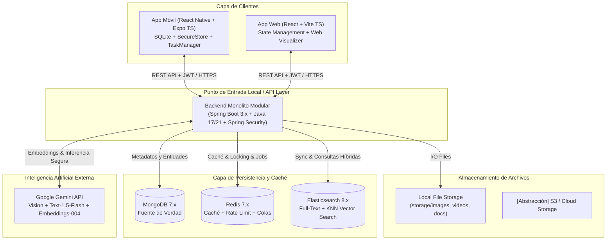
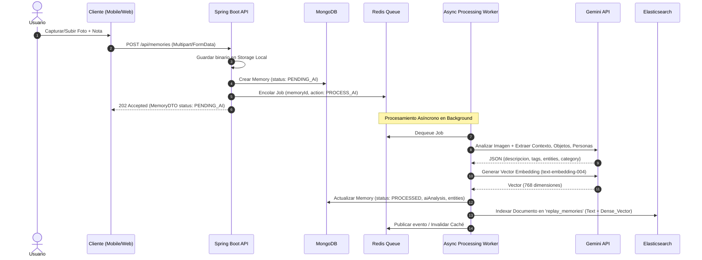
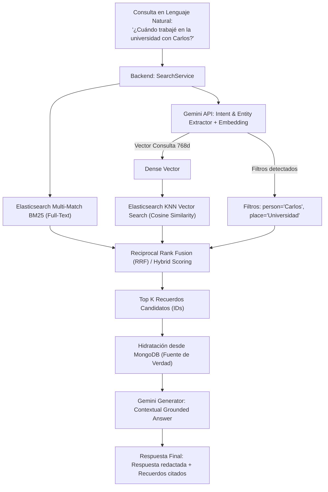
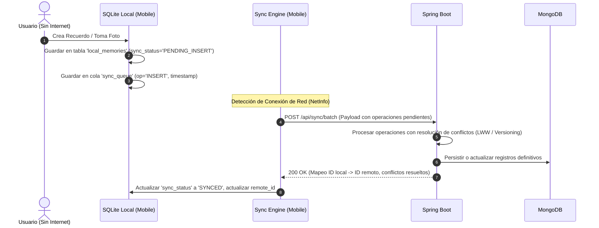
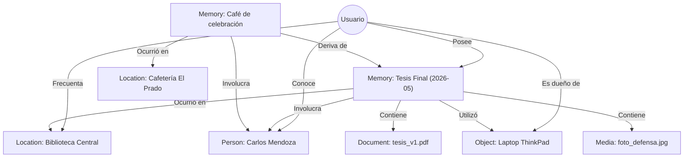

# REPLAY: ARQUITECTURA GENERAL Y DIAGRAMAS DEL SISTEMA

## 1. Visión y Concepto Central
**REPLAY** no es un almacén de archivos convencional ni una galería de fotos con tags automáticos. Es un **Motor de Memoria Personal (Personal Memory Engine)** concebido como un sistema cognitivo digital offline-first que estructura la vida de un individuo a través de un grafo espacio-temporal denominado **Life Graph**.

---

## 2. Diagramas de Arquitectura (Mermaid)

### Diagrama 1: Arquitectura General del Sistema

---

### Diagrama 2: Arquitectura Modular del Backend (Spring Boot)

```mermaid
graph LR
    subgraph API_Layer ["Controllers / REST Endpoints"]
        AuthController["Auth & Security"]
        MemoryController["Memories & Timeline"]
        SearchController["Hybrid Search"]
        GraphController["Life Graph & Entities"]
        SyncController["Offline Synchronization"]
    end

    subgraph Core_Modules ["Módulos de Negocio Monolito"]
        AuthMod["auth & users"]
        MemMod["memories & events"]
        MediaMod["media & storage"]
        AIMod["ai & embeddings"]
        SearchMod["search (ES)"]
        SyncMod["synchronization"]
        GraphMod["people, places, objects"]
    end

    subgraph Data_Access ["Repositories & Clients"]
        MongoRepo["Spring Data MongoDB"]
        ESClient["Elasticsearch Java Client"]
        RedisTemplate["Spring Data Redis"]
        GeminiClient["Gemini REST Client"]
    end

    API_Layer --> Core_Modules
    Core_Modules --> Data_Access
```

---

### Diagrama 3: Flujo de Creación y Procesamiento Asíncrono de un Recuerdo

---

### Diagrama 4: Pipeline de Búsqueda Híbrida Inteligente (Full-Text + Semantic Vector)

---

### Diagrama 5: Sincronización Offline-First con Expo SQLite

---

### Diagrama 6: Modelo Relacional Lógico Life Graph

