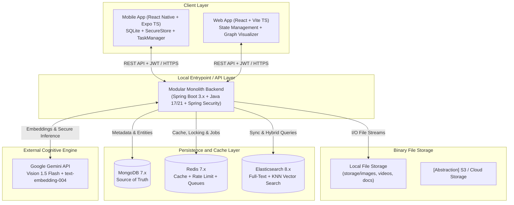
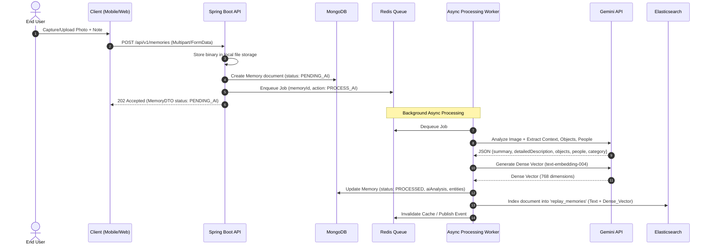
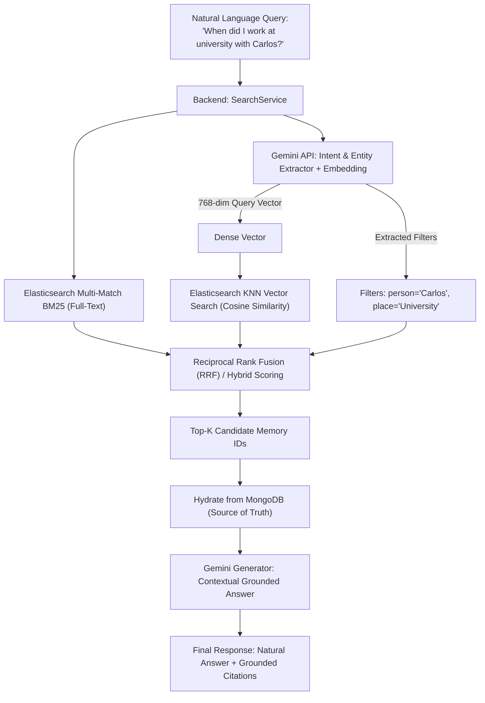
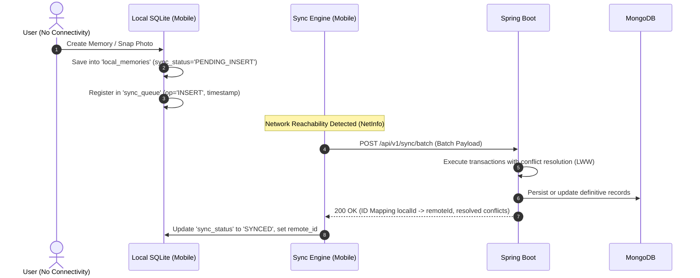
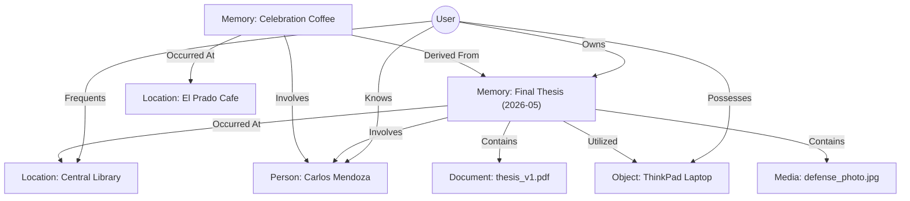

# REPLAY: GENERAL ARCHITECTURE AND SYSTEM DIAGRAMS

## 1. System Vision and Core Concept
**REPLAY** is not a simple file storage bucket or photo gallery with automatic labels. It is an **Offline-First Personal Memory Engine** engineered as an individual cognitive system that structures biographical data through a spatio-temporal graph called the **Life Graph**.

---

## 2. Architectural Diagrams (Mermaid)

### Diagram 1: High-Level System Architecture

---

### Diagram 2: Backend Modular Monolith Architecture

```mermaid
graph LR
    subgraph API_Layer ["Controllers / REST Endpoints"]
        AuthController["Auth & Security"]
        MemoryController["Memories & Timeline"]
        SearchController["Hybrid Search"]
        GraphController["Life Graph & Entities"]
        SyncController["Offline Synchronization"]
    end

    subgraph Core_Modules ["Modular Monolith Business Layer"]
        AuthMod["auth & users"]
        MemMod["memories & events"]
        MediaMod["media & storage"]
        AIMod["ai & embeddings"]
        SearchMod["search (ES)"]
        SyncMod["synchronization"]
        GraphMod["people, places, objects"]
    end

    subgraph Data_Access ["Repositories & Clients"]
        MongoRepo["Spring Data MongoDB"]
        ESClient["Elasticsearch Java Client"]
        RedisTemplate["Spring Data Redis"]
        GeminiClient["Gemini REST Client"]
    end

    API_Layer --> Core_Modules
    Core_Modules --> Data_Access
```

---

### Diagram 3: Memory Creation and Asynchronous Processing Lifecycle

---

### Diagram 4: Hybrid Intelligent Search Pipeline (Full-Text + Semantic Vector)

---

### Diagram 5: Offline-First Synchronization Lifecycle (Expo SQLite)

---

### Diagram 6: Logical Life Graph Model

